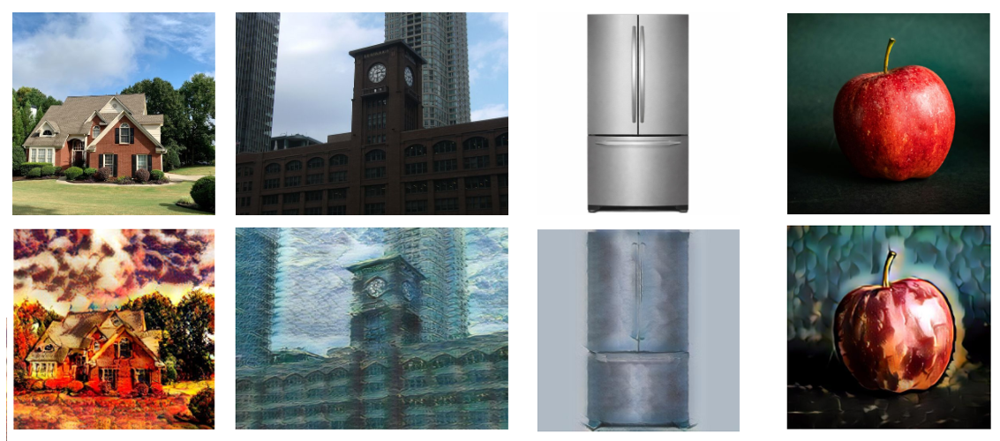
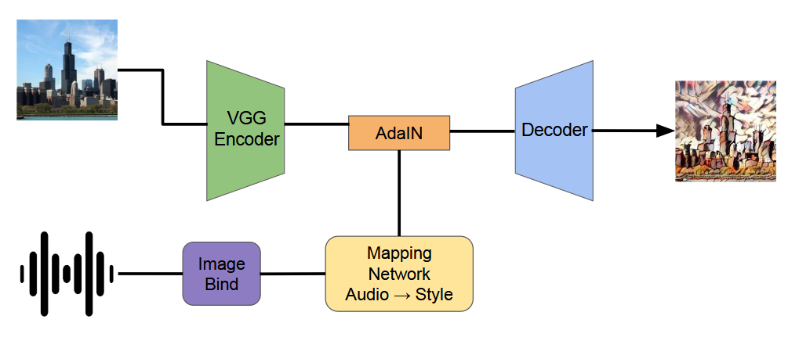

# Audio-driven Image Stylization

This project combines audio and images to generate stylized image outputs. An audio clip is mapped to a visual style and applied to an input image using an AdaIN-based image stylization pipeline.

## Example results

The top row shows the original images and the bottom row shows the corresponding audio-driven stylizations.

<table>
  <tr>
    <th>volcano.wav</th>
    <th>scuba.wav</th>
    <th>snow.mp3</th>
    <th>BillyJean.wav</th>
  </tr>
  <tr>
    <td><audio controls src="examples/volcano.wav">volcano.wav</audio></td>
    <td><audio controls src="examples/scuba.wav">scuba.wav</audio></td>
    <td><audio controls src="examples/snow.mp3">snow.mp3</audio></td>
    <td><audio controls src="examples/BillyJean.wav">BillyJean.wav</audio></td>
  </tr>
</table>

## Pipeline

An input image is encoded with the VGG. In parallel, ImageBind extracts an embedding from the audio, and a mapping network converts it into a style representation. AdaIN combines the image content with this audio-derived style, and the decoder generates the stylized output.

## Dataset creation

- **Images:** Stable Diffusion 1.5 was used to generate 10,000 images.
- **Audio:** A split of the [FSD50K dataset](https://zenodo.org/records/4060432) was used to obtain 10,000 audio clips.

The images and audio clips are paired to train the audio-to-style mapping network.
